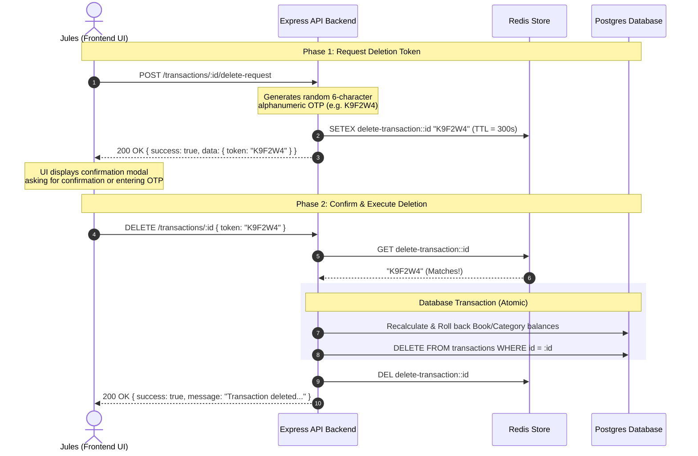

# Transactions Ledger API - Frontend Integration Guide

Hi **Jules**, this guide details the schemas, endpoints, and integration patterns for the new backend Transactions feature.

---

## 1. Data Model & Type Definitions

Each transaction returned by the API has the following JSON structure:

```typescript
export interface Transaction {
  id: string;          // Cryptographically secure UUID (v4)
  name: string;        // Functional title of the ledger action
  amount: string;      // Floating-point numeric string representing the financial volume (e.g. "150.00")
  type: "credit" | "debit"; // Transaction type
  bookId: string;      // UUID pointing to the parent Book container
  categoryId: string | null; // Nullable string relation pointer pointing to the category (cast to string from integer serial)
  createdAt: string;   // ISO-8601 UTC timestamp string
  updatedAt: string;   // ISO-8601 UTC timestamp string
}
```

---

## 2. API Reference

All requests must be authenticated. The base route for transactions is `/transactions`.

### 2.1. Create a Transaction
Create a new transaction and automatically adjust book and category balances.

* **Path**: `POST /transactions`
* **Content-Type**: `application/json`
* **Request Body**:
```typescript
{
  name: string;                   // title (min 1 character)
  amount: number;                 // positive finite float value (e.g. 50.25)
  type: "credit" | "debit";       // credit (adds to balance), debit (subtracts from balance)
  bookId: string;                 // valid UUID string of the target Book
  categoryId?: number | string | null; // optional sub-category pointer
}
```

* **Success Response (201 Created)**:
```json
{
  "success": true,
  "message": "Transaction created successfully",
  "data": {
    "transaction": {
      "id": "e4b6c310-91bf-4fa3-956b-3129487c569f",
      "name": "Supermarket Grocery",
      "amount": "50.25",
      "type": "debit",
      "bookId": "a1b2c3d4-e5f6-7a8b-9c0d-1e2f3a4b5c6d",
      "categoryId": "12",
      "createdAt": "2026-06-25T18:15:00.000Z",
      "updatedAt": "2026-06-25T18:15:00.000Z"
    }
  }
}
```

---

### 2.2. Get Transactions List
Query transaction history. Results are ordered by `createdAt` descending.

* **Path**: `GET /transactions`
* **Query Parameters**:
  - `bookId` (optional): Filter list to a specific Book (UUID).
  - `categoryId` (optional): Filter list to a specific Category (integer ID).

* **Success Response (200 OK)**:
```json
{
  "success": true,
  "data": [
    {
      "id": "e4b6c310-91bf-4fa3-956b-3129487c569f",
      "name": "Monthly Salary",
      "amount": "3000.00",
      "type": "credit",
      "bookId": "a1b2c3d4-e5f6-7a8b-9c0d-1e2f3a4b5c6d",
      "categoryId": null,
      "createdAt": "2026-06-25T18:10:00.000Z",
      "updatedAt": "2026-06-25T18:10:00.000Z"
    }
  ]
}
```

---

### 2.3. Update a Transaction
Modify transaction fields. The backend automatically reverses the impact of the previous values (amount, type, bookId, categoryId) before applying the new values.

* **Path**: `PUT /transactions/:id`
* **Content-Type**: `application/json`
* **Request Body** (All fields are optional for partial updates):
```typescript
{
  name?: string;
  amount?: number;
  type?: "credit" | "debit";
  bookId?: string;
  categoryId?: number | string | null;
}
```

* **Success Response (200 OK)**:
```json
{
  "success": true,
  "message": "Transaction updated successfully",
  "data": {
    "transaction": {
      "id": "e4b6c310-91bf-4fa3-956b-3129487c569f",
      "name": "Supermarket Grocery (Updated)",
      "amount": "45.00",
      "type": "debit",
      "bookId": "a1b2c3d4-e5f6-7a8b-9c0d-1e2f3a4b5c6d",
      "categoryId": "12",
      "createdAt": "2026-06-25T18:15:00.000Z",
      "updatedAt": "2026-06-25T18:20:00.000Z"
    }
  }
}
```

---

## 3. Two-Step Verification Deletion Sequence

To prevent accidental deletions of financial history, transactions require a two-phase destruction flow utilizing a 5-minute Redis-backed token check.



### Phase 1: Request Deletion Token
* **Path**: `POST /transactions/:id/delete-request`
* **Success Response (200 OK)**:
```json
{
  "success": true,
  "message": "Verification token generated. Please confirm deletion using this token.",
  "data": {
    "token": "K9F2W4"
  }
}
```
> [!NOTE]
> Cache TTL is strictly **5 minutes (300 seconds)**. The token will expire and delete requests will fail if Phase 2 is not completed within this threshold.

### Phase 2: Confirm Deletion
* **Path**: `DELETE /transactions/:id`
* **Content-Type**: `application/json`
* **Request Body**:
```json
{
  "token": "K9F2W4"
}
```

* **Success Response (200 OK)**:
```json
{
  "success": true,
  "message": "Transaction deleted and balances recalculated successfully."
}
```

* **Error Response (400 Bad Request)** (Mismatch or Expired token):
```json
{
  "success": false,
  "message": "Token expired or not found. Please request a new deletion token."
}
```
or
```json
{
  "success": false,
  "message": "Invalid verification token."
}
```
